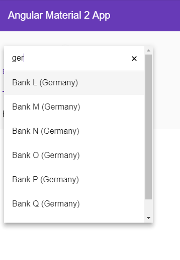

# NgxMatSelectSearch
[https://github.com/bithost-gmbh/ngx-mat-select-search](https://github.com/bithost-gmbh/ngx-mat-select-search)


## What does it do?
This library provides an angular component providing an input field for searching / filtering [MatSelect](https://material.angular.io/components/select/overview) options of the [Angular Material](https://material.angular.io) library.



See it in action at [https://stackblitz.com/github/bithost-gmbh/ngx-mat-select-search-example](https://stackblitz.com/github/bithost-gmbh/ngx-mat-select-search-example?file=src%2Fapp%2Fapp.component.html)

**Important Note**: This project is meant as a temporary implementation of [https://github.com/angular/material2/issues/5697](https://github.com/angular/material2/issues/5697).
The goal is to have an implementation in the official Angular Material repository, 
once [https://github.com/angular/material2/pull/7835](https://github.com/angular/material2/pull/7835)
is merged.

## How to use it?
Install `ngx-mat-select-search` in your project:
```
npm install ngx-mat-select-search
```

Import the `NgxMatSelectSearchModule` in your `app.module.ts`:
```typescript
import { MatFormFieldModule, MatSelectModule } from '@angular/material';
import { NgxMatSelectSearchModule } from 'ngx-mat-select-search';

@NgModule({
  imports: [
    ReactiveFormsModule,
    BrowserAnimationsModule,
    MatSelectModule,
    MatFormFieldModule,
    NgxMatSelectSearchModule
  ],
})
export class AppModule {}
```

Use the `ngx-mat-select-search` component inside a `mat-select` element:
```html
<mat-form-field>
  <mat-select [formControl]="bankCtrl" placeholder="Bank" #singleSelect>
    <ngx-mat-select-search [formControl]="bankFilterCtrl"></ngx-mat-select-search>
    <mat-option *ngFor="let bank of filteredBanks | async" [value]="bank">
      {{bank.name}}
    </mat-option>
  </mat-select>
</mat-form-field>
```
See the example in [https://github.com/bithost-gmbh/ngx-mat-select-search/blob/master/src/app/app.component.html](https://github.com/bithost-gmbh/ngx-mat-select-search/blob/master/src/app/app.component.html)
and [https://github.com/bithost-gmbh/ngx-mat-select-search/blob/master/src/app/app.component.ts](https://github.com/bithost-gmbh/ngx-mat-select-search/blob/master/src/app/app.component.ts)
how to wire the `ngx-mat-select-search` and filter the options available.
Or have a look at [https://github.com/bithost-gmbh/ngx-mat-select-search-example](https://github.com/bithost-gmbh/ngx-mat-select-search-example) to see it in a standalone app.

### API
The `MatSelectSearchComponent` implements the [ControlValueAccessor](https://angular.io/api/forms/ControlValueAccessor) interface.
Furthermore, it provides the following inputs:

#### Inputs
```typescript
  /** Label of the search placeholder */
  @Input() placeholderLabel = 'Suche';

  /** Label to be shown when no entries are found. Set to null if no message should be shown. */
  @Input() noEntriesFoundLabel = 'Keine Optionen gefunden';

  /** 
    * Whether or not the search field should be cleared after the dropdown menu is closed. 
    * Useful for server-side filtering. See [#3](https://github.com/bithost-gmbh/ngx-mat-select-search/issues/3) 
    */
  @Input() clearSearchInput = false;
```


## Development

This project was generated with [Angular CLI](https://github.com/angular/angular-cli) version 1.7.1.

## Contributions
Contributions are welcome, please open an issue and preferrably file a pull request.

## Development server

Run `ng serve` for a dev server. Navigate to `http://localhost:4200/`. The app will automatically reload if you change any of the source files.

### Build

Run `ng build` to build the project. The build artifacts will be stored in the `dist/` directory. Use the `-prod` flag for a production build.

### Library Build / NPM Package
Run `npm run build-lib` to build the library and generate an NPM package. 
The build artifacts will be stored in the `dist-lib/` folder.

### Running unit tests

Run `npm run test` to execute the unit tests via [Karma](https://karma-runner.github.io).
